# Diagram 01 — The Paladin Stack

Where Paladin sits in the overall system.

## ASCII

```
┌───────────────────────────────────────────────────────────────┐
│                        Applications                            │
│         dApps · frontends · backends · CLI clients             │
└──────────────────────┬────────────────────────────────────────┘
                       │  JSON-RPC (pgroup_*, ptx_*, keymgr_*)
                       ▼
┌───────────────────────────────────────────────────────────────┐
│                Paladin Node (Go core + Java plug-ins)          │
│                                                                │
│  ┌───────────────┐  ┌───────────────┐  ┌────────────────┐     │
│  │ Group Manager │  │  Identity     │  │ Private TX     │     │
│  │  (pgroup_*)   │  │  Resolver     │  │ Manager        │     │
│  └───────────────┘  └───────────────┘  └────────────────┘     │
│  ┌───────────────┐  ┌───────────────┐  ┌────────────────┐     │
│  │ State Manager │  │ Transport     │  │ Domain Manager │     │
│  │ (UTXO store)  │  │ Manager       │  │                │     │
│  └───────────────┘  └───────────────┘  └────────────────┘     │
│                                                                │
│  ┌──────────┐  ┌──────────┐  ┌──────────┐                     │
│  │ Pente    │  │ Noto     │  │ Zeto     │  ← Domain plug-ins  │
│  │ (private │  │ (notary  │  │ (ZK      │                     │
│  │  EVM)    │  │  token)  │  │  token)  │                     │
│  └──────────┘  └──────────┘  └──────────┘                     │
└──────────────────────┬────────────────────────────────────────┘
                       │  base chain RPC
                       ▼
┌───────────────────────────────────────────────────────────────┐
│               Hyperledger Besu (base chain)                    │
│    Public UTXO commitments, endorsements, atomic settlement    │
└───────────────────────────────────────────────────────────────┘
```

## Mermaid

```mermaid
flowchart TB
    App[Applications<br/>dApps · frontends · backends]
    subgraph Paladin[Paladin Node]
        direction TB
        subgraph Core[Go core]
            GM[Group Mgr]
            ID[Identity Resolver]
            PTM[Private TX Mgr]
            SM[State Mgr — UTXO]
            TM[Transport Mgr]
            DM[Domain Mgr]
        end
        subgraph Domains[Domain plug-ins]
            Pente[Pente<br/>private EVM]
            Noto[Noto<br/>notary token]
            Zeto[Zeto<br/>ZK token]
        end
    end
    Besu[Hyperledger Besu<br/>base chain]

    App -->|JSON-RPC| GM
    App -->|JSON-RPC| PTM
    GM --> DM
    PTM --> DM
    DM --> Pente
    DM --> Noto
    DM --> Zeto
    Pente --> SM
    SM --> TM
    TM --> Besu
    Pente --> Besu
```



## Reading it

- Everything above the Besu line is Paladin. All of it is Apache-2.0 licensed and operable on your own infrastructure.
- Everything below is standard Hyperledger Besu.
- Applications never talk to Besu directly for private data. They talk to Paladin's RPC.
- The private compute happens inside domain plug-ins (Pente for EVM, Noto for notary-style tokens, Zeto for ZK tokens).
