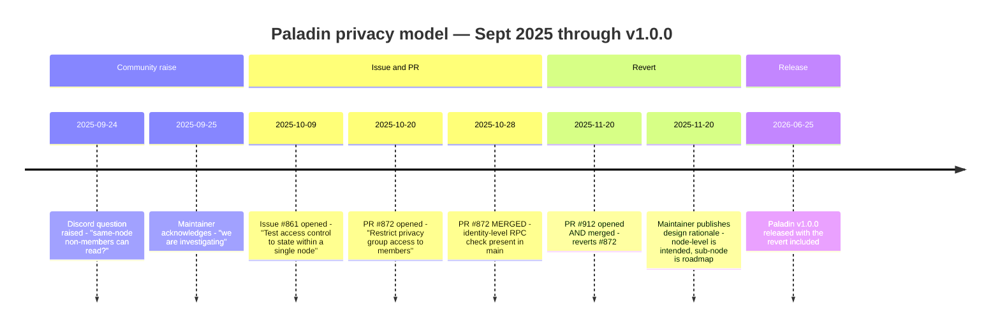

# Diagram 03 — Privacy Model Timeline

## Mermaid timeline



## ASCII (for slides)

```
2025-09-24  ─┬─  Discord: same-node non-member privacy question raised
             │
2025-09-25  ─┼─  Maintainer response: "investigating"
             │
2025-10-09  ─┼─  Issue #861 opened by maintainer
             │
2025-10-20  ─┼─  PR #872 opened (adds membership check)
             │
2025-10-28  ─┼─  PR #872 MERGED
             │   ↑ identity-level check present in main
             │      (three-week window)
2025-11-20  ─┼─  PR #912 MERGED (revert #872)
             │   ↑ back to node-level privacy
             │
2025-11-20  ─┼─  Maintainer publishes design rationale:
             │   "node-level is intended; sub-node is roadmap"
             │
2026-06-25  ─┴─  v1.0.0 released (contains the revert)
                    ↑ this is what production users get today
```

## What the timeline actually shows

- The three-week window (Oct 28 – Nov 20) is the ONLY period Paladin `main` enforced identity-level RPC access.
- The revert was intentional and design-driven, not a bug fix. Maintainer Andrew Richardson explicitly explained the reasoning on the PR and on Discord.
- Any documentation or evaluation report written during that window that claimed "PR #872 fixes identity-level access" is out of date for anything past 2025-11-20.
- v1.0.0 (the current stable release) contains the revert. Sub-node privacy did not ship with v1.0.
