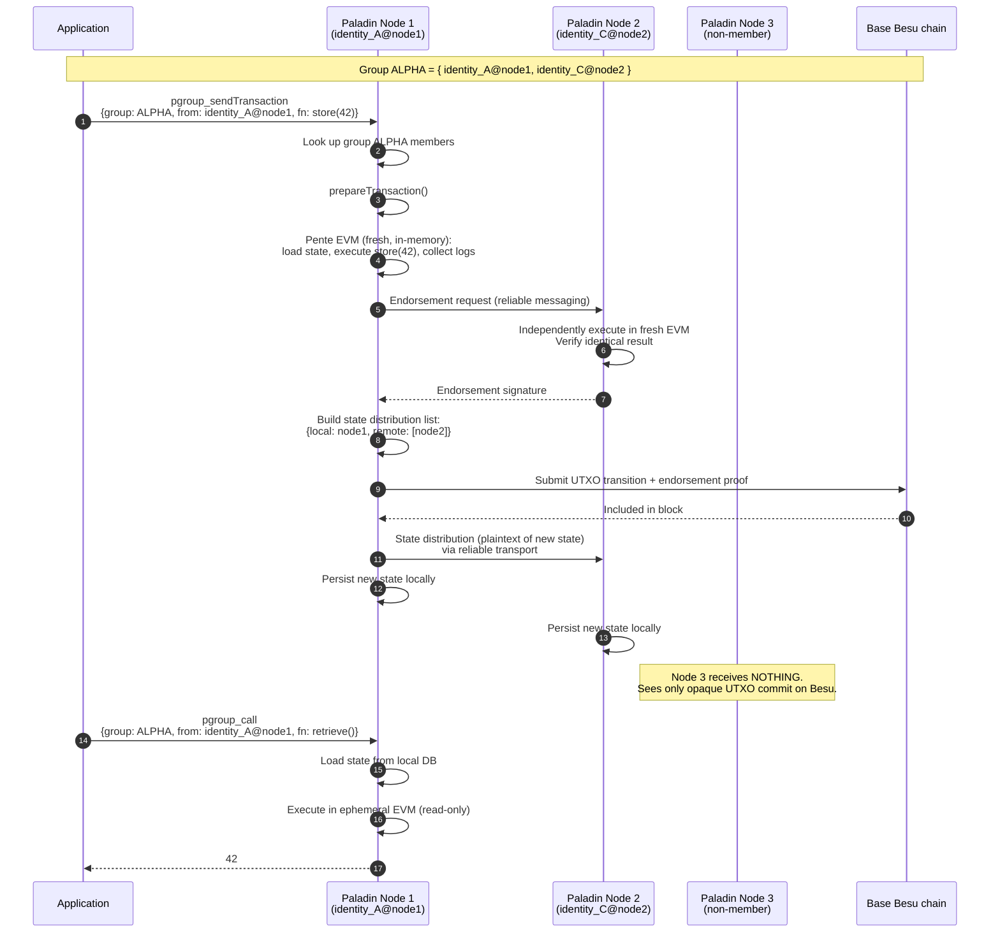

# Diagram 05 — Privacy Group Lifecycle

End-to-end sequence for a single private transaction.

## Mermaid sequence

## Reading the diagram

- Steps 3–5 are the ephemeral EVM: fresh Besu EVM instance in memory, discarded after use.
- Steps 6–7 give multi-party endorsement. Each endorser independently executes and confirms the same result before signing.
- Step 8 is the state distribution list. Only member nodes appear.
- Step 9 is what hits the base chain: a UTXO transition plus an endorsement proof. **No plaintext data.**
- The `Note over N3` line is the privacy guarantee — non-member nodes get nothing.
- Steps 13–17 are the read path. Entirely local. No base-chain round-trip. Fast.

## What if the caller is a same-node non-member?

If in step 1 the application had called with `from: identity_B@node1` (identity_B is NOT in ALPHA's members but is on node 1):

- Under Paladin v1.0.0 (the current state): the call proceeds the same way. Node 1 has ALPHA's state locally, so the read/write goes through.
- Under the brief PR #872 window (Oct 28 – Nov 20 2025): the call was rejected at step 3 with `PD012524: From identity 'identity_B@node1' is not a member of privacy group 'ALPHA'`.

See [Page 2 — history](../docs/02-privacy-model-history.md).

## What if the caller's node is not a member at all?

If a client tries to `pgroup_call` on node 3 (which is not in ALPHA):

- Node 3 never received ALPHA's state distribution — its DB has no rows for ALPHA.
- The call fails with `PD012502: Privacy group '0x...' not found`.
- This is cryptographic isolation: node 3 cannot possibly answer, because it doesn't have the data.
