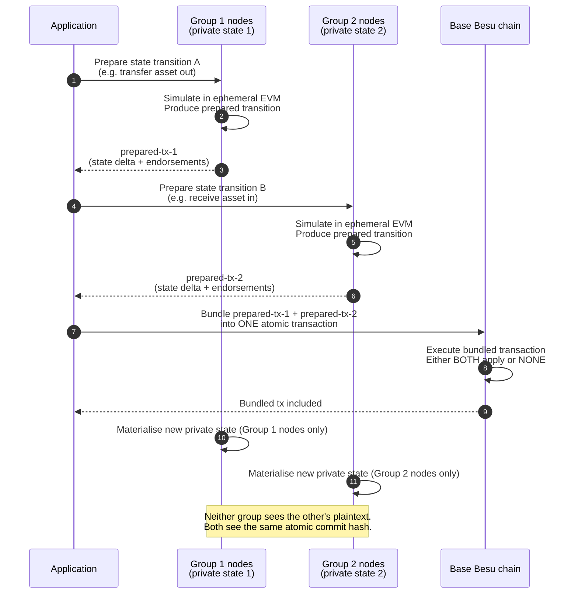

# Diagram 08 — Atomic Cross-Group Transaction

Two privacy groups cannot directly read or write each other's state (that would defeat isolation). But they CAN atomically settle a coordinated transaction via the base chain — either both state transitions apply or both revert.

## Mermaid sequence

## What this enables

- Cross-project composite transactions.
- Atomic asset swaps across privacy boundaries.
- Multi-party settlement flows where each party sees only their side of the transaction.

## Reference implementations

- [`examples/swap/`](https://github.com/LFDT-Paladin/paladin/tree/main/examples/swap) — atomic swap of a Zeto (ZK) asset for a Noto (notary) asset, coordinated across two privacy groups.
- [`examples/notarized-tokens/`](https://github.com/LFDT-Paladin/paladin/tree/main/examples/notarized-tokens) — token flows spanning multiple contexts.

## What is NOT possible

Directly reading or writing across group boundaries is not supported. If Group 1 needs a value from Group 2, it must be moved via an atomic-swap-style flow (or exposed via a shared meta-group that both are members of).

## Isolation properties preserved

- Each group's plaintext never leaves its member nodes.
- The base chain sees only opaque commitments for both transitions.
- Non-participating groups (or nodes) see nothing beyond the bundled base-chain transaction hash.
